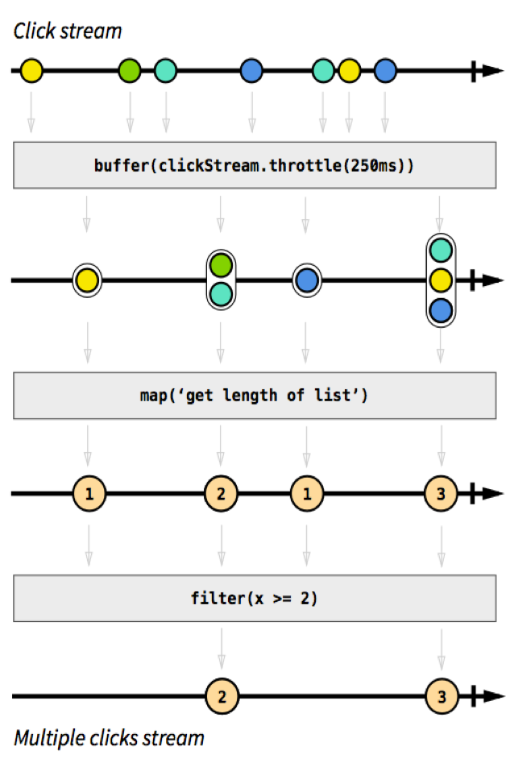

[上一篇](https://www.nams.site/posts/%E5%87%BD%E6%95%B0%E5%BC%8F%E7%BC%96%E7%A8%8B%E4%B8%80/)介绍了函数式编程的一些概念，接下来我会结合前端这个特定领域介绍一些函数式编程的应用。

对于前端而言，终极的目的是生成用户UI，与过去简单的静态页面不同，如今的前端充斥着大量的状态和数据，如果我们继续命令式地操作Dom，可以想像将是一场灾难。

而随着MVVM模式的诞生，许多框架选择把视图层抽象出来，比如React的Jsx和Vue的模版引擎，它们都为我们提供了另一种创建UI的思路：

UI = Render(Data)

这样我们就可以只专注于Data的编写，而把渲染的过程交给框架，而框架也可以利用这一点解耦HTML，为不同的平台提供不同的渲染器，从而促成了RN和Weex之类的库的诞生。当然，现在也无从考证是函数式思想影响了这些框架引入抽象视图层，还是框架选择抽象试图无意间和函数式编程所吻合。

---

诚然，如果我们的应用越来越大，视图也会随之增多，每个组件之间势必会多出一些冗余的数据并且组件的交互也更加繁琐：


如果我们把冗余的数据提取成单独的一层，势必会让我们的组件更加精简：


所以一众状态管理的库也因此诞生，其中又以Redux和函数式的关系最为紧密。

与CURD类型的状态管理库不同，redux采用了另一种思路：Event Sourcing。在这种体系下，我们只存储事件的记录，而不存储具体状态，当我们需要具体状态时，我们只要从头开始计算所有的事件即可，所以redux给我们提供了强大的状态追踪功能，我们可以方便的进行状态的时间旅行。

对于事件来说，它只描述发生了什么，具体的应用状态，我们需要Reducer进行计算，我们可以把状态计算的过程抽象为下面的式子：

```javascript
newState = reducer(oldState, action)
```

每一次产生事件，redux都会根据旧的状态和事件产生出一个新的状态，让react重新渲染视图，所以整个生命周期中，状态的迭代过程如下：


---

除了redux之外，还有另一个我们熟知的库：Rxjs。

在谈Rxjs之前，我们先说说函数响应式编程（Functional Reactive Programming）。简单的说，它就是采用函数式编程的方法进行响应式编程的编程范式。

响应式编程有以下几个特点：

- 事件驱动
- 可拓展性
- 可伸缩性

用户界面和网络请求都是基于事件的，所以函数响应式编程特别适合于Web应用，而Rxjs则是目前使用最为广泛的库。

在Rxjs中，把所有的事件都看成了**流**。作为响应式编程的核心，流的本质是一个按时间顺序排列的进行中事件的序列集合，而Rxjs提供了许多操作流的方法，让我们可以在更高的抽象维度去进行编程。比如当我们需要过滤出连续点击两次或更多事件时，在rxjs中我们可以这样操作：

我们使用原生js需要大量代码才能实现的功能，在rxjs中只需要几个操作就可以完成。

---

如今的软件开发已经越来越复杂，使用单一的某种思想或工具已经无法应对越来越多的难题。还是那句话，在计算机科学里没用绝对的最佳实践，我们需要对不同的问题采取不同的解决方法，而每学习一种新的思想，都会帮助我们拓宽解决问题的思路。